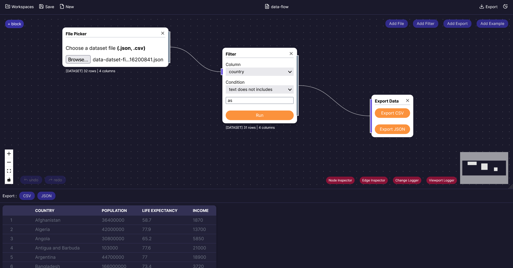

# Datablock Demo

<p align="center">
  
</p>

This is a DataBlock based project based on `React-flow`, check [Live Demo](https://datablock-demo.vercel.app/).

## Getting Started

First, run the development server:

```bash
npm run dev
# or  
yarn dev
# or
pnpm dev
# or
bun dev
```

Open [http://localhost:3000](http://localhost:3000) with your browser to see the result.

You can start editing the page by modifying `app/page.tsx`. The page auto-updates as you edit the file.